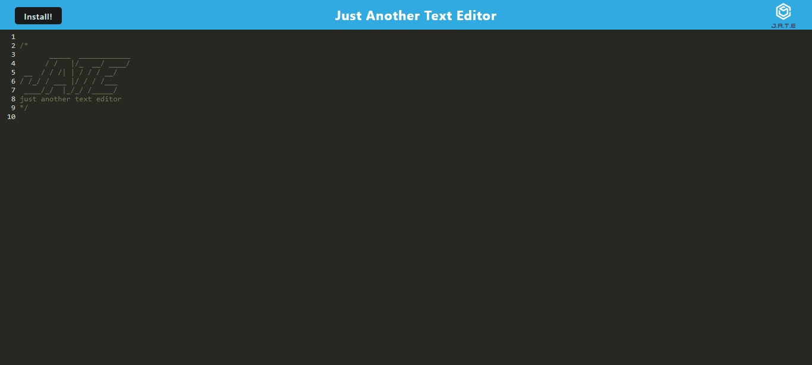

# Flawless Text Editor PWA
This app is Progressive Web App that creates a single page application that will work offline if user has no internet connection. 

## Table of Contents
- [Installation](#Installation)
- [Usage](#Usage)
- [Contributing](#Contributing)
- [Technologies](#Technologies)
- [Questions](#Questions)
- [Acknowledgments](#Acknowledgments)

## Installation
This app is intalled in the Heroku cloud. Try it out at the following link  
https://flawless-text-editor-pwa.herokuapp.com/

## Usage 
Upon reaching the site you will see the text editor page. All data that is input into the page will be saved to the client when you leave. The manifest is built upon starting. User can open dev tools and see that as information is added to the scrren it is saved locally into the IndexedDB instantly. 

## Contributing 
Here are the steps in order to contribute to this project.
1. **Fork** the repo on GitHub
2. **Clone** the project to your own machine
3. **Commit** changes to your own branch
4. **Push** your work back up to your fork
5. Submit a **Pull Request** so that we can review your changes

NOTE: Be sure to merge the latest from `main` before making a pull request!

## Technologies
- JavaScript
- Node.JS
- Webpack
- Workbox
- IndexedDB
- Service Workers 

## Questions
Please refer any questions or problem issues to bhoff1980@gmail.com.

## Acknowledgments
Andres Jimenez (Tudor)  
Kirtley Adams (Teaching Assistant)  
Dan Kaltenbaugh (Instructor) 
George Yoo (Teaching Assisstant)